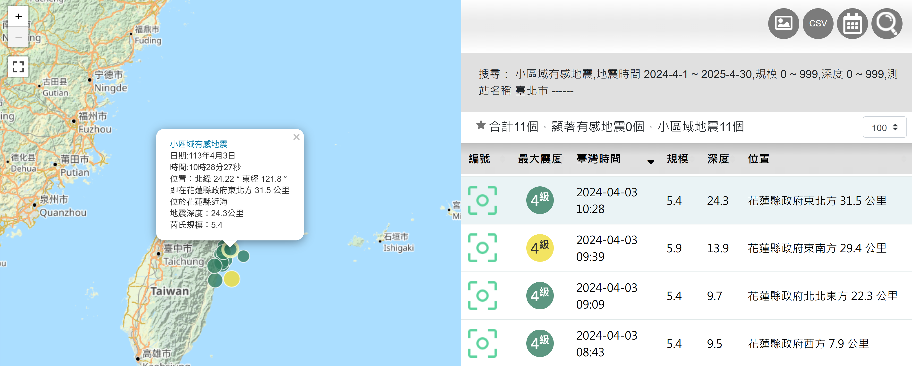

# Earthquake Data 
## Overview
從 https://scweb.cwa.gov.tw/zh-tw/earthquake/data
下載台北、台南、新竹、台中顯著有感地震和小區域有感地震。

## 名詞說明

| 名稱            | 說明                                                                 |
|-----------------|----------------------------------------------------------------------|
| **Origin Time** | 地震發生日期及時間（台灣時間）                                        |
| **Lat**         | 地震震央緯度，以度為單位                                             |
| **Lon**         | 地震震央經度，以度為單位                                             |
| **Depth**       | 地震震源深度，以公里為單位                                           |
| **Mag**         | 地震芮氏規模                                                        |
| **Stacode**     | 即時強地動監測站站名                                                |
| **Staname**     | 即時強地動監測站中文地名                                            |
| **Stalat**      | 即時強地動監測站位置緯度，以度為單位                                 |
| **Stalon**      | 即時強地動監測站位置經度，以度為單位                                 |
| **Dist**        | 測站震央距離，以公里為單位                                           |
| **BAZ**         | 測站方位角，以度為單位                                               |
| **PGA**         | 最大地動加速度，以 gal（cm/s²）為單位，分垂直向（V）、南北向（NS）、東西向（EW）等三個分量 |
| **PGV**         | 最大地動速度，以 kine（cm/s）為單位，分垂直向（V）、南北向（NS）、東西向（EW）等三個分量 |
| **Int**         | 震度分級，分 0 級、1 級、2 級、3 級、4 級、5 弱、5 強、6 弱、6 強、7 級等 10 級 |
| **PGA(SUM)**    | 最大合成地動加速度，以 gal（cm/s²）為單位                             |
| **PGV(SUM)**    | 最大合成地動速度，以 kine（cm/s）為單位                              |
| **註**          | 109 年之前震度分級，分 0 級、1 級、2 級、3 級、4 級、5 級、6 級、7 級等 8 級 |

1. 局發地震(local earthquake)：最大有感半徑小於100公里。

2. 小區域地震(small-felt-area earthquake)：最大有感半徑從100公里到200公里。

3. 稍顯著地震(moderate earthquake)：最大有感半徑從 200公里到300公里。

4. 顯著地震(remarkable earthquake)：最大有感半徑300公里及以上。
## File Structure

小區域有感地震，官方未提供詳細 txt 檔案，從網頁 extract 出來的資料，下載後轉換成json格式，並存放在`earthquake_reginal_data/`資料夾中。

    url = f"https://scweb.cwa.gov.tw/zh-tw/earthquake/details/{YYYYMMDDHHMMSS}{magnitude}"

顯著有感地震，官方提供txt檔案，下載後轉換成json格式，並存放在`earthquake_data/json/`資料夾中。

    url = f"https://scweb.cwa.gov.tw/zh-tw/earthquake/download?file=%2FdrawTrace%2Foutcome%2F{year}%2F{year}{earthquake_id}.txt"

